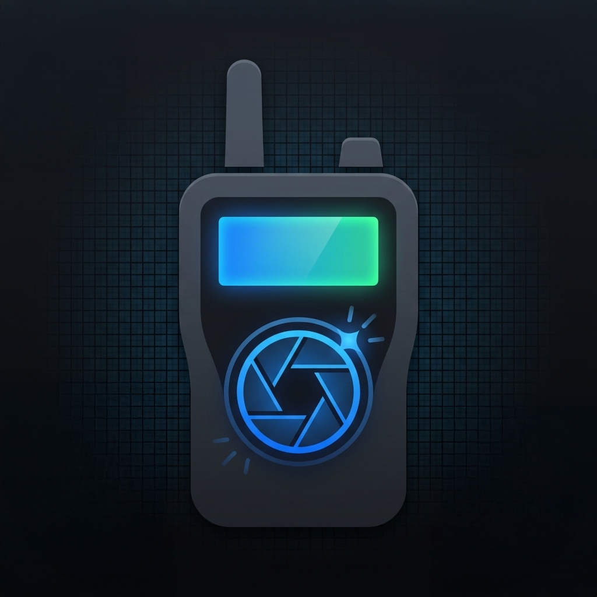

# RadShot

<p align="center">
  
</p>

A lightweight Windows screenshot capture tool for the Radtel RT-4D radio display. Captures the 128x64 monochrome LCD screen via serial connection.

## Screenshot

<!-- Add a screenshot of the application here -->


## Features

- **Serial Connection** - Connect to your RT-4D radio via COM port
- **Screenshot Capture** - Capture the radio's LCD display with a single click
- **Gallery View** - Browse and manage multiple captured screenshots
- **Save & Export** - Save individual screenshots or all at once as PNG files
- **Clipboard Support** - Copy screenshots directly to clipboard for quick pasting
- **Settings Persistence** - Remembers window position, COM port, and save directory

## Requirements

- Windows 10 or later
- Radtel RT-4D radio with USB cable
- Appropriate USB-serial drivers installed

## Building

Run the build script:

```batch
build.bat
```

This compiles the application using MSVC (Visual Studio Build Tools required).

## Usage

1. Connect your RT-4D radio via USB
2. Launch RadShot
3. Select the COM port from the dropdown and click **Connect**
4. Click **Take Screenshot** to capture the radio display
5. Use **Save** to export as PNG or **Copy** to copy to clipboard

## License

MIT License
