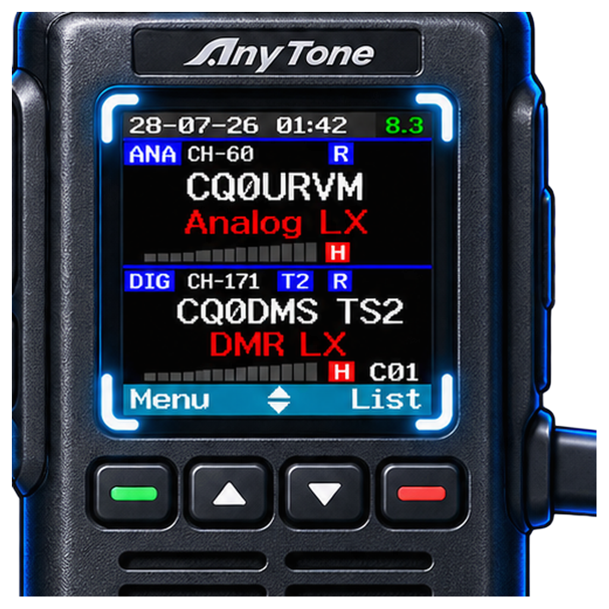

# AT168Shot

<p align="center">
  
</p>

A cross-platform screenshot capture tool for the AnyTone 168 radio display. Captures the 128x160 colour TFT screen via serial connection.

This is the AnyTone 168 fork of [RadShot](../../tree/main), which targets the Radtel RT-4D.

> [!CAUTION]
> This software will ONLY work correctly on screenshot-enabled firmware builds.

> [!IMPORTANT]
> Please don't ask for real time refresh of the display, this would cause a massive slowdown.

## Protocol

| | |
|---|---|
| Command | `SCR` (ASCII, no terminator) |
| Response | 40960 bytes, no header |
| Pixel format | 16-bit RGB565, little endian |
| Layout | 128 consecutive runs of 160 pixels; each run is one display **column** |
| Serial | 8N1, 921600 baud by default (selectable) |

Because the frame arrives column by column, the raw image is the transpose of what the
radio shows and has to be rotated and mirrored to look right. The default (**Rotate 90
CW** + **Mirror**) is that transpose; if a capture still comes out sideways or mirrored,
the two controls next to the preview cover every other possibility, and the choice is
remembered between runs.

`SCR` is an addition of the screenshot-enabled firmware; it is not part of the stock
AnyTone program-mode protocol, and no handshake precedes it — entering program mode would
put the radio's programming screen on the display, which is not the screen you want to
capture.

### Baud rate

**921600** is what this radio uses for its program-mode link, per
[at168-cps](https://github.com/jcalado/at168-cps) and the at168-flasher tools. 115200 is
the rate qdmr uses for other AnyTone radios, and 4 Mbaud is the firmware-update and
license speed. The picker next to the port carries all of them and the choice is
remembered, so finding the right one needs no rebuild.

**Connect only opens the port** — nothing is written to the radio until you press *Take
Screenshot*.


## Features

- **Serial Connection** - Connect to your AnyTone 168 radio via serial port at a selectable baud rate
- **Screenshot Capture** - Capture the radio's LCD display with a single click
- **Gallery View** - Browse and manage multiple captured screenshots
- **Save & Export** - Save individual screenshots or all at once as PNG files
- **Clipboard Support** - Copy screenshots directly to clipboard for quick pasting
- **Orientation Controls** - Rotate and mirror captures to match the physical display
- **Settings Persistence** - Remembers window position, serial port, save directory, and orientation
- **Cross-Platform** - Runs on Windows, Linux, and macOS

## Requirements

- **Windows**: Windows 10 or later
- **Linux**: X11 or Wayland desktop, OpenGL 3.0+
- **macOS**: macOS 11+ (Apple Silicon native)
- AnyTone 168 radio with USB cable
- Appropriate USB-serial drivers installed

## Building

Requires CMake 3.16+ and a C++ compiler.

```sh
cmake -B build -DCMAKE_BUILD_TYPE=Release
cmake --build build --config Release
```

On Windows, you can also use the build script:

```batch
build.bat
```

### Linux dependencies

Install the required development packages:

```sh
# Ubuntu/Debian
sudo apt install libgl1-mesa-dev libx11-dev libxrandr-dev libxinerama-dev libxcursor-dev libxi-dev

# Fedora
sudo dnf install mesa-libGL-devel libX11-devel libXrandr-devel libXinerama-devel libXcursor-devel libXi-devel
```

## Usage

1. Connect your AnyTone 168 radio via USB
2. Launch AT168Shot
3. Select the serial port from the dropdown and click **Connect**
4. Click **Take Screenshot** to capture the radio display
5. If the image is sideways or mirrored, adjust the orientation controls next to the preview
6. Use **Save** to export as PNG or **Copy** to copy to clipboard

### Linux notes

- Add your user to the `dialout` group for serial port access: `sudo usermod -aG dialout $USER` (log out and back in)
- Clipboard copy requires `xclip` (X11) or `wl-copy` (Wayland)
- File dialogs require `zenity` (GNOME) or `kdialog` (KDE)

### macOS notes

- If Gatekeeper blocks the unsigned binary: `xattr -d com.apple.quarantine at168shot`

## Support

If you like my work, you can support me at [ko-fi.com/jcalado](https://ko-fi.com/jcalado)
